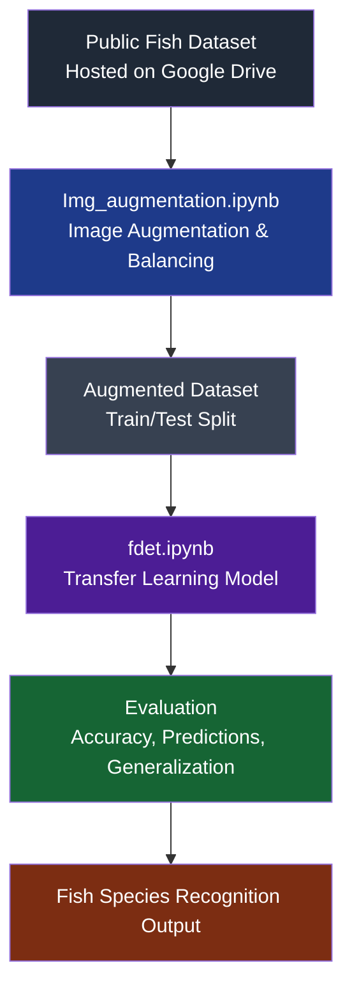
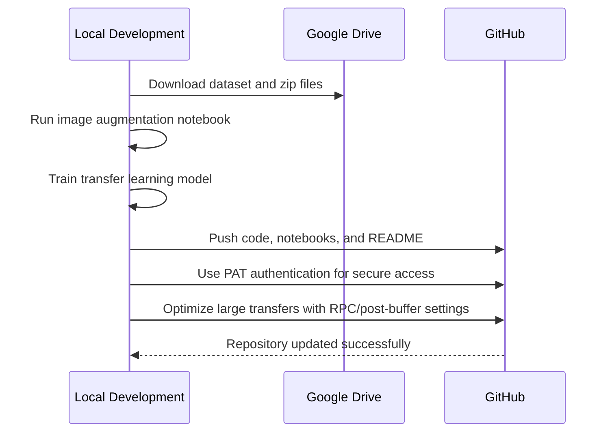

# Fish Detection & Recognition System


## Overview

Fish Detection & Recognition System is a deep learning project designed to detect and classify four fish species: **Catla, Grass, Gulfaam, and Silver**. It uses image augmentation and transfer learning to build a balanced, robust model that can generalize well across classes and reduce overfitting.

The project is structured to look and feel like a real portfolio-grade machine learning workflow, from data preparation and augmentation to training, evaluation, and repository optimization.

## Dataset & Availability

This project uses a **public fish image dataset** containing **572 images total**, with **143 images per class**.

Because GitHub has file size limitations, the dataset and large `.zip` files are hosted externally on Google Drive.

🔗 **[Access Original & Augmented Dataset (Google Drive)](https://drive.google.com/file/d/17dh2Rrd67AF69YdQr8-R9io0kSeV9Fn5/view?usp=sharing)**

### Class Distribution

- Catla: 143 images.
- Grass: 143 images.
- Gulfaam: 143 images.
- Silver: 143 images.

## Model Architecture

The project uses **custom transfer learning** with **Keras/TensorFlow** and pre-trained weights to classify fish species.

The workflow is split across two main notebooks:

- `Img_augmentation.ipynb`: Dataset preparation and augmentation.
- `fdet.ipynb`: Fish detection and recognition model training.

### Workflow



### Sequence of Execution



## Results

The model was trained on a **balanced dataset**, which improved class consistency and helped reduce bias toward any single fish species.

Key outcomes include:

- Balanced augmentation across all four classes.
- Improved generalization through transfer learning.
- Better resistance to overfitting compared to a non-augmented baseline.
- Clean separation between preparation and training workflows.

## Repository Optimization & Infrastructure

To keep the repository clean, lightweight, and easy to clone, I used `.gitignore` to exclude large binaries and generated artifacts from version control.

I also handled practical GitHub deployment challenges by:

- Working around GitHub’s **100MB file limit**.
- Configuring **RPC post-buffer** settings for large notebook transfers.
- Using **Personal Access Token (PAT)** authentication for secure terminal-based Git operations.
- Hosting large datasets externally on Google Drive instead of committing them directly to the repository.

These steps made the project more maintainable and showed awareness of real-world repository and deployment constraints.

## Installation & Requirements

Install the required dependencies:

```bash
pip install -r requirements.txt
```

### How to Run

1. Clone the repository.
2. Download the dataset from Google Drive.
3. Place the dataset in the expected data folder.
4. Open `Img_augmentation.ipynb` to prepare the augmented dataset.
5. Open `fdet.ipynb` to train and evaluate the model.

Example:

```bash
git clone <your-repo-url>
cd fish-detection-recognition
pip install -r requirements.txt
```

## Project Value

This project demonstrates more than just model training. It shows the ability to:

- Prepare and balance image data.
- Build a transfer learning pipeline.
- Evaluate classification performance.
- Manage large files and repository constraints professionally.
- Present a machine learning project in a clean, recruiter-friendly format.

For a technical or support-oriented role, this also shows good judgment in handling data hygiene, environment setup, and deployment reliability.

## Contact / Portfolio

- GitHub: [Your GitHub Profile](LINK_HERE)
- LinkedIn: [Your LinkedIn Profile](LINK_HERE)
- Email: [Your Email](mailto:your.email@example.com)

## Notes

If you want to make this even stronger, you can add:

- A confusion matrix image.
- Sample predictions.
- A short “Future Work” section.
- A screenshot of the augmentation pipeline or model results.